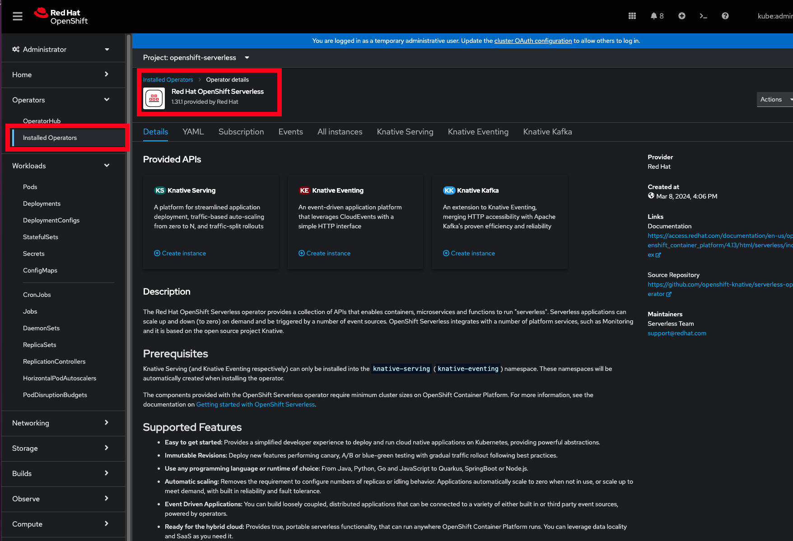
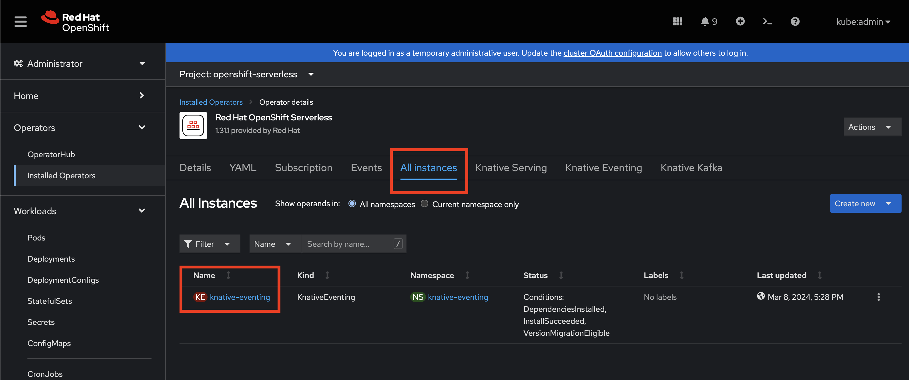
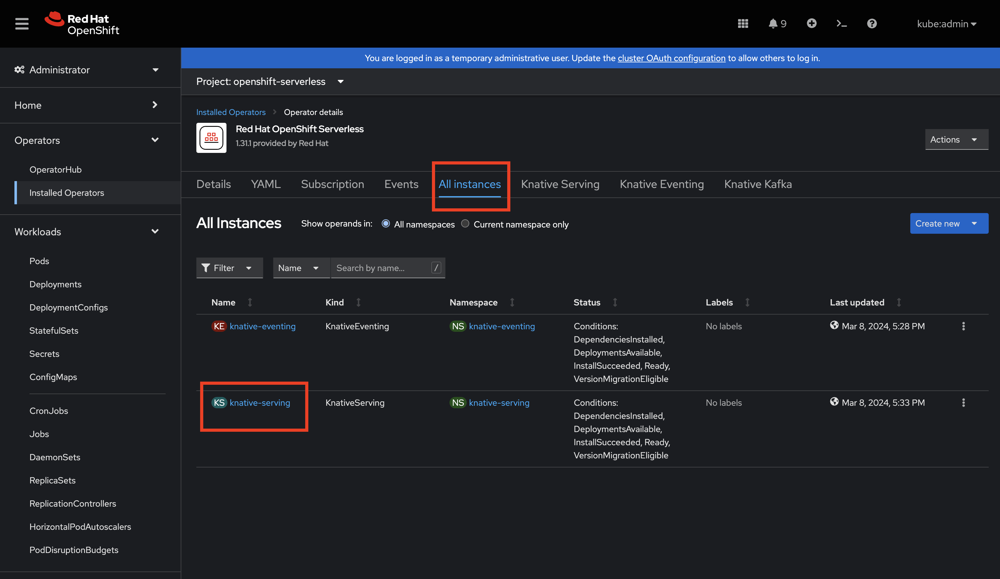

# serverless-operator

Deploys the web terminal operator on Red Hat OpenShift via kustomize. Serverless applications can scale up and down (to zero) on demand and be triggered by a number of event sources. 

Do not use the base directory directly, as you will need to patch the channel based on the version of OpenShift you are using, or the version of the operator you want to use.

## Usage

### Install the Serverless Operator

```
# if cloned
$ oc apply -k operator/overlays/stable

# not cloned
$ oc apply -k https://github.com/dmarcus-wire/serverless-operator/tree/main/operator/overlays/stable
```




### Install Knative Eventing for Serverless
An event-driven application platform that leverages CloudEvents with a simple HTTP interface

```
# if cloned
$ oc apply -k instance/knative-eventing/overlays/default

# not cloned
$ oc apply -k https://github.com/dmarcus-wire/serverless-operator/blob/main/instance/knative-eventing/overlays/default/
```




### Install Knative Serving for Serverless
A platform for streamlined application deployment, traffic-based auto-scaling from zero to N, and traffic-split rollouts

```
# if cloned
$ oc apply -k instance/knative-serving/overlays/default

# not cloned
$ oc apply -k https://github.com/dmarcus-wire/serverless-operator/blob/main/instance/knative-serving/overlays/default/
```



### Install Knative Kafka for Serverless
An extension to Knative Eventing, merging HTTP accessibility with Apache Kafka's proven efficiency and reliability


